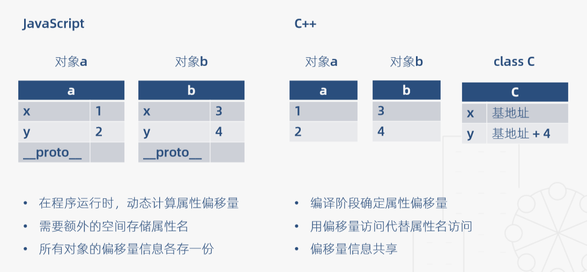
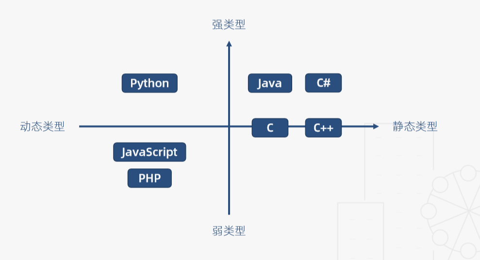
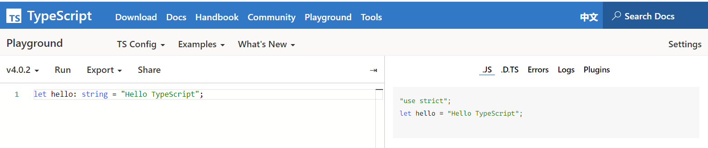
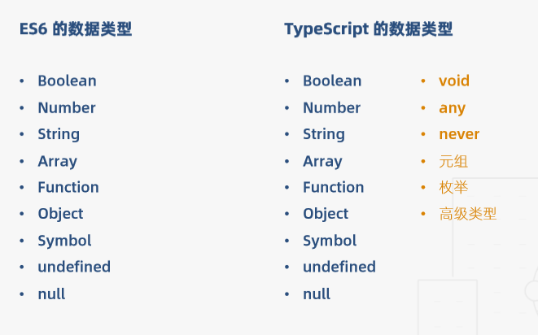
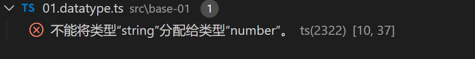
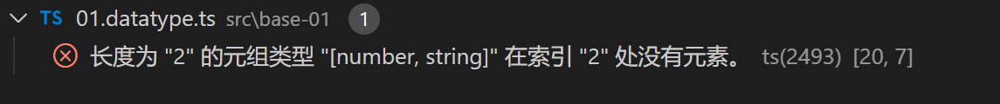

## 类型基础

### 强类型语言与弱类型语言

**强类型语言**（通俗定义）:  强类型语言不允许改变变量的数据类型，除非进行强制类型转换

1、 在Java代码中，如下变量x定义为整数类型，y定义为布尔类型 如果将y赋值给x会报错，因为类型不兼容

```java
int x = 1;
boolean y = true;
x = y;
System.out.println(x);
// incompatible types: boolean cannot be converted to int
```

2、下面这个例子发生了强制类型转换，字符类型被强制转换为整数类型，x打印结果为97

```java
int x = 1;
boolean y = true;
// x = y;
char z = 'a';
x = z;
System.out.println(x); // 97
```


**弱类型语言**：在弱类型语言中，变量可以被赋予不同的数据类型

如下在JavaScript中，变量x初始值为number类型，也可以被赋值为boolean类型和string类型

```js
let x = 1;
let y = true;
x = y;
console.log(x); // true
let z = 'a';
x = z;
console.log(x); // a
```


### 静态类型语言与动态类型语言

>通俗定义：
>
>`静态类型语言`：在编译阶段确定所有变量的类型
>
>`动态类型语言`:   在执行阶段确定所有变量的类型


首先看一段js代码：

```js
Javascript:

class C {
	constructor (x, y) {
		this.x = x;
		this.y = y;
    }
}

function add (a, b) {
	return a.x + a.y + b.x + b.y;
}
```

上面代码在被编译时，完全不知道变量a和b是什么类型，只有当程序运行时，对a、b参数传入值时，才知道变量a和b是什么类型。


接着，我们再看一段功能类似的C++代码

```c++
class C {
	public:
		int x;
		int y;
}

int add (C a, C b) {
	return a.x + a.y + b.x + b.y;
}
```

C++代码在编译的时候就已经能确定变量a和b的类型了。


接下来，再从内存分配的角度进行对比：

1.Javascript

- 在程序运行时，动态计算属性偏移量（对象中的属性a、b相对于对象基地址的偏移量）；
- 需要额外的空间存储属性名；
- 所有对象的偏移量信息各存一份；

2.C++

- 编译阶段确定属性偏移量
- 用偏移量访问代替属性名访问
- 偏移量信息共享；





### 总结

| 强类型语言                                               | 弱类型语言                                                   |
| -------------------------------------------------------- | ------------------------------------------------------------ |
| 强类型语言不允许改变变量的数据类型，除非进行强制类型转换 | 弱类型语言中，变量的值其类型是宽泛的，可以被赋值多种类型的值 |

| 静态类型语言   | 动态类型语言            |
| -------------- | ----------------------- |
| 对类型极度严格 | 对类型非常宽松          |
| 立即发现错误   | Bug可能隐藏数月甚至数年 |
| 运行时性能好   | 运行时性能差            |
| 自文档化       | 可读性差                |

基于上面，我们多半会觉得静态语言明显好于动态语言啊，为什么JavaScript现在这么火呢？

动态类型语言（JavaScript）的支持者认为：

- 性能是可以改善的（V8引擎），而语言的灵活性更加重要；
- 隐藏的错误可以通过单元测试发现；
- 文档可以通过工具生成；

所以，任何语言其都具有两面性，同时也是在不断发展与进化的，不能一概而论。

最后给出一张象限图：




## 重塑“类型思维”


### TypeScript缘起

​	JavaScript是一门动态弱类型语言，对变量的类型非常宽容，而且不会在这些变量和它们的调用者之间建立结构化的契约。

​	在ES标准推出静态类型检查之前，TypeScript是当下解决此问题的最佳方案。


### 什么是TypeScript

TypeScript是拥有**类型系统**的JavaScript的超集，可以编译成纯JavaScript:

- 类型检查
- 语言扩展
- 工具属性


### 为什么要使用TypeScript

使用**TypeScript**的其他好处

- 接口定义代替文档
- IDE能够提高开发效率，降低维护成本
- 重塑”类型思维“


>在你的脑中播下**“类型思维”**的种子
>
>- 思维方式决定了编程习惯
>- 编程习惯奠定了工程质量
>- 工程质量划定了能力边界


## 编写第一个TypeScript程序(环境搭建)

### 创建项目

现在我们来编写一个TypeScript程序（hello-typescript）

1. 首先我们新建一个文件夹,初始化项目

   ```ts
   mkdir hello-typescript
   
   npm init -y
   ```

   

2. 安装TypeScript

   ```ts
   npm i typescript -D
   // 也可以安装到全局，这样方便在任何地方使用TypeScript编译
   // package.json文件中配置运行脚本则需本地安装
   
   // 安装完之后tsc -h可查看帮助信息
   tsc -h
   ```

3. 创建配置项tsconfig.json

   ```ts
   tsc --init
   ```

4. 在当前目录，我们新建一个src文件夹，并在里面新建一个index.ts文件，输入以下代码：

   ```ts
   let hello: string = "Hello TypeScript";
   ```

   上面代码的`string`是类型注解。

   这时我们便可以通过tsc命令将该文件编译成js代码，我们输入**tsc ./src/index.ts**，将会在src目录下生成一个index.js文件：

   ```js
   var hello = "Hello TypeScript";
   ```

   也可以在官方的**PlayGround: http://www.typescriptlang.org/play/index.html**中输入ts代码，我们将能预览到编译后的js代码。



### 基于webpack搭建项目结构

1. 下载webpack包

   ```ts
   npm i webpack webpack-cli -D
   ```

2. 下载webpack-dev-server:

   ```ts
   // 这个npm包用于已服务的方式运行项目，并进行热更新
   npm i webpack-dev-server -D
   ```

3. 创建**build**目录  用来存放配置文件

   项目一般会有开发环境和生产环境，相对应的，我们可以将webpack配置分成三份——开发配置、生产配置、基础（公共）配置，不同的环境，将公共配置和对应的配置合并在一起，以下是我们webpack配置文件的目录结构：

   ```ts
   --build
   ----webpack.base.config.js
   ----webpack.dev.config.js
   ----webpack.pro.config.js
   ----webpack.config.js
   ```

4. 在编写这些配置文件之前，我们先安装一些需要用到的loader和plugin

   ```ts
   // ts-loader用于编译ts代码；
   npm i ts-loader -D
   
   // html-webpack-plugin会将打包后的脚本通过script的方式注入到模版html文件中；
   npm i html-webpack-plugin -D
   
   // clean-webpack-plugin会在将打包文件打包到对应目录（一般为dist）之前，将dist目录里的文件清空；
   npm i clean-webpack-plugin -D
   
   // webpack-merge用于合并webpack配置；
   npm i webpack-merge -D
   ```

5. 新增一个模板html文件  **src/tpl/index.html**

   ```html
   // src/tpl/index.html
   
   <!DOCTYPE html>
   <html lang="en">
   <head>
       <meta charset="UTF-8">
       <meta name="viewport" content="width=device-width, initial-scale=1.0">
       <meta http-equiv="X-UA-Compatible" content="ie=edge">
       <title>TypeScript in Action</title>
   </head>
   <body>
       <div class="app"></div>
   </body>
   </html>
   
   ```

6. 编写配置文件

   **基础(公共)配置webpack.base.config.js:** 

   ```js
   const HtmlWebpackPlugin = require('html-webpack-plugin')
   
   module.exports = {
       entry: './src/index.ts',
       output: {
           filename: 'app.js'
       },
       resolve: {
           extensions: ['.js', '.ts', '.tsx']
       },
       module: {
           rules: [
               {
                   test: /\.tsx?$/i,
                   use: [{
                       loader: 'ts-loader'
                   }],
                   exclude: /node_modules/
               }
           ]
       },
       plugins: [
           new HtmlWebpackPlugin({
               template: './src/tpl/index.html'
           })
       ]
   }
   ```

   

   **开发环境配置webpack.dev.config.js:**

   ```js
   module.exports = {
       devtool: 'cheap-module-eval-source-map'
   }
   ```

   

   **生产环境配置webpack.pro.config.js:**

   ```js
   const { CleanWebpackPlugin } = require('clean-webpack-plugin')
   
   module.exports = {
       plugins: [
           new CleanWebpackPlugin()
       ]
   }
   
   ```

   **入口配置webpack.config.js:**

   ```js
   const { merge } = require('webpack-merge')
   const baseConfig = require('./webpack.base.config')
   const devConfig = require('./webpack.dev.config')
   const proConfig = require('./webpack.pro.config')
   
   module.exports = (env, argv) => {
       let config = argv.mode === 'development' ? devConfig : proConfig;
       return merge(baseConfig, config);
   };
   
   ```

   这里有一个比较有意思的东西，就是`webpack.dev.config.js`中配置的devtool配置项，该配置项跟sourcemap有关，我们这里配置的是`cheap-module-eval-source-map`，这也是官方推荐的一个配置项，我们可以将这个配置项拆成几份来解读：

   - cheap表示系统会忽略代码的列信息，因为我们在进行代码调试的时候往往只关注行信息；
   - module表示系统将会定位我们的源代码，即我们在项目中编写的ts源码，而不是编译后的js代码；
   - eval表示sourcemap将会以data url的形式打包到文件中；
   - 官方还有其他的组合形式，具体可以点击这里查阅：https://webpack.js.org/configuration/devtool/#root（这里提醒一下，官方文档最好看英文版，因为是最新的，国内的文档往往更新比较慢）

7. 在package.json中配置npm运行脚本：

   ```json
   "scripts": {
       "start": "webpack-dev-server --mode=development --config ./build/webpack.config.js",
       "build": "webpack --mode=production --config ./build/webpack.config.js",
     },
   ```

   > **注意：**
   >
   > 更改packjson.json的入口  初始化项目时默认入口为index.js
   >
   > "main": "./src/index.ts"

8. 到这里，我们就可以通过`npm start`来运行项目，通过`npm run build`打包项目


## 基本类型

TS的数据类型在ES6的基础上新增了一些类型，比如说`void`、`any`、`never`、`元组`、`枚举`还有一些其他的`高级类型`玩法




### 类型注解

在对比分析每种数据类型之前，有必要先了解TS中的类型注解。它相当于**强类型语言中的类型声明**，作用和C语言中“int a = 1”的int声明一样，具体语法如：`(变量/函数):type`，即在变量名后面加一个“类型”，如：

```ts
let n: number = 100
```

通过添加类型注解之后，我们就不能随便将其他类型的数据赋值给当前变量了，比如上面的n，我们不能将字符串赋值给它，不然vscode将会给我们格式高亮报错`Type '"xxx"' is not assignable to type 'number'.`


### 原始类型

JS中最基础的三个数据类型Boolean、Number、String的声明方式如下：

```ts
let bool: boolean = true
let num: number = 1
let str: string = 'handsome boy'
```


### 数组

TypeScript像JavaScript一样可以操作数组元素。 有两种方式可以定义数组。 

```ts
// 第一种，可以在元素类型后面接上 `[]`，表示由此类型元素组成的一个数组：
let arr1: number[] = [1, 2, 3];

// 第二种方式是使用数组泛型，Array<元素类型>：
let arr2: Array<number> = [1, 2, 3];
```

从上面我们可以发现的是，和原生的js相比，数组中每个元素的类型都在声明的时候已经绑定好了，所以如果其中插入一些非数字类型的数据，编辑器将会报错。比如：

```ts
let arr2: Array<number> = [1, 2, 3, 'string'];
```



那如果要使得在数组中可以插入其他类型的数据呢，则可以采用联合类型的方式，比如：

```ts
let arr2: Array<number | string> = [1, 2, 3, 'string'];
```

这样，数组就能包含多种数据类型了


### 元组

元组是一种特殊的数组，它控制了数组成员的类型和数量，比如：

```ts
let tuple: [number, string] = [0, '1'];
```

上面代码就控制了三个条件：

- 数组第一个元素是数字类型；
- 数组第二个元素是字符串类型；
- 数组中只能有两个元素；

接下来我们来看下元组的越界问题：

```ts
let tuple: [number, string] = [1, 'abc']
tuple.push(2)
console.log(tuple) // [1, "abc", 2]
tuple[2] // 编辑器会报错
```



虽然元组可以通过push方法添加新元素，但是元组仍然无法访问刚添加的新元素。


### 函数

函数的声明需要给参数添加类型注解，如下：

```ts
// 没有规定返回值类型，利用TS的类型推断得到返回值为number类型
let add = (a: number, b: number) => a + b 
或者
let add = (a: number, b: number): number => a + b
```

函数的声明还有一种形式：(先声明后实现)

```ts
let add:  (a: number, b: number) => number
add = (n, m) => n + m
```

这种方式在实现时可以不写注解，参数名也可以和声明时不一样。

> 函数会在后面单独一节具体介绍函数的四种定义方式、可选参数、函数重载等概念


### 对象

按照JS的用法，或许我们觉得可以如下方式声明与操作对象：

```ts
let obj: object = { x: 1, y: 2 }
obj['x'] = 2 // 报错，ts中不知道你声明的对象中有x属性
```

TS中应该这样做

```ts
let obj: {x: number, y: number} = {x: 1, y: 2}
obj.x = 2
```


### Symbol

```ts
let s1: symbol = symbol()
或者
let s2 = symbol()
console.log(s1 === s2); // false
```


### undefined, null

当一个变量被声明成undefined或null，该变量只能被赋值undefined或者null:

```ts
let un: undefined = undefined;
let nu: null = null;
```

在ts官网中，undefined和null是任何类型的子类型，说明undefined和null可以赋值给任何其他类型，但不能直接赋值：

```ts
/* 会报错 */
let num: number
num = undefined
num = null
```

要使得上面代码不报错，需要修改下ts的配置文件**tsconfig.js**：

```json
"strictNullChecks": false,              /* Enable strict null checks. */
```

或者，如果想要用比较严格的语法，可以使用**联合类型**，比如：`let num: number | undefined | null`


### void

在js中，void是一种操作符号，可以让任何表达式返回undefined，比如最简单的一种返回undefined的方式为`void 0`。（注：undefined不是js中的保留字，完全可以通过一个undefined变量覆盖，比如：`(function () {var undefined = 111; console.log(undefined)})()），在全局声明是没效果的`）

在ts中，void的意思是“没有返回值”，通常用来标示函数没有返回值（可以理解为函数没有return），个人理解为它是一种“标示”，和C语言中的void是类似的。

```ts
let noReturn = () => {};
```


### any

any即任何类型，ts中只要不指定类型注解即可。

```ts
let x;
x = 1;
x = [];
x = () => {};
```


### never

这个类型和void有些相似，也是不返回值，标示函数，比如：

```ts
let error = () => {
  throw new Error('error');
}

let endless = () => {
  while(true) {}
}
```

通俗理解void与never：

- void可以理解为一个没有return但能执行完毕的函数；
- never是一个函数体无法结束执行的函数；


> 后续将继续更新blog内容  如需查看剩余内容可先移步到**study-code/src/base-01**中查看代码，里面都有详细的注释

后续更新内容：
- 枚举类型
- 接口
- 函数相关知识梳理
- 类
- 类与接口的关系
- 泛型
- 类型检查机制
  - 类型推断
  - 类型兼容
  - 类型保护
- 高级类型
  - 交叉类型与联合类型
  - 索引类型
  - 映射类型
  - 条件类型


